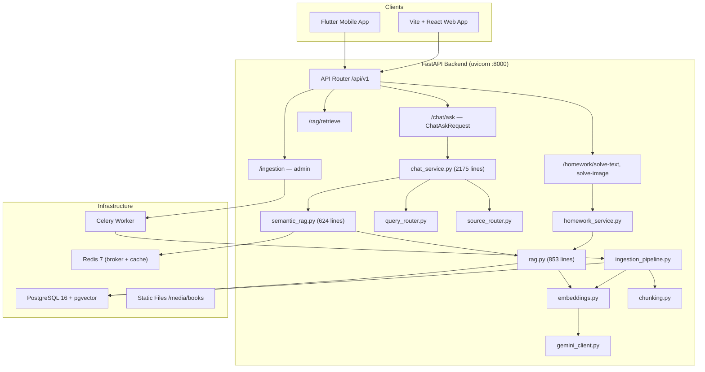
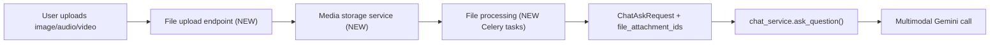

# EduMind Codebase Analysis — Architecture & Multimedia Integration Points

## 1. Current Architecture Summary



### Technology Stack

| Layer | Technology |
|---|---|
| **Backend** | Python 3.12+ / FastAPI / Uvicorn |
| **Database** | PostgreSQL 16 + pgvector (prod), SQLite + aiosqlite (local dev) |
| **Vector Store** | pgvector `Vector(768)` column on `rag_chunks` table, IVFFlat index |
| **Embedding** | Gemini `gemini-embedding-001` (primary), `intfloat/multilingual-e5-base` (local fallback), deterministic hash (smoke tests) |
| **LLM** | Gemini `gemini-3.5-flash` (chat/extraction), `gemini-2.0-flash` (reranking) |
| **Task Queue** | Celery 5.4 + Redis broker |
| **Cache** | Redis 7 (RAG query cache, semantic rewrite cache, source routing cache) |
| **ORM** | SQLAlchemy 2.0 + Alembic migrations |
| **PDF Processing** | PyMuPDF, pdfplumber, pdf2image, Gemini Files API (OCR) |
| **Frontend (mobile)** | Flutter + Provider |
| **Frontend (web)** | Vite + React + TypeScript |

---

## 2. Existing Component Inventory

### 2.1 RAG Service

| File | Role | Size |
|---|---|---|
| [rag.py](file:///Users/sereenkh/Github-Projects/AI-Chemistry-Tutor/backend/app/services/rag.py) | Core retrieval: hybrid vector+lexical scoring, Arabic query cleanup/rewriting, term expansion, intent-based content-type boosting, Redis caching | 853 lines |
| [semantic_rag.py](file:///Users/sereenkh/Github-Projects/AI-Chemistry-Tutor/backend/app/services/semantic_rag.py) | Advanced pipeline: Gemini-powered query rewrite, HyDE generation, multi-query expansion, RRF fusion, Gemini reranking, quality gate | 624 lines |
| [embeddings.py](file:///Users/sereenkh/Github-Projects/AI-Chemistry-Tutor/backend/app/services/embeddings.py) | 3-tier embedding provider: Gemini → local multilingual → hash fallback, batch embedding support | 210 lines |
| [source_router.py](file:///Users/sereenkh/Github-Projects/AI-Chemistry-Tutor/backend/app/services/source_router.py) | Routes queries to textbook vs. solutions source types based on Arabic keyword detection | 242 lines |
| [query_router.py](file:///Users/sereenkh/Github-Projects/AI-Chemistry-Tutor/backend/app/services/query_router.py) | Direct-answer routing for common chemistry questions | 9,320 bytes |

**Key data flow**: `ChatAskRequest → chat_service.ask_question() → semantic_rag.semantic_retrieve_context() → rag.retrieve_context() → pgvector cosine + lexical ILIKE → hybrid scoring → Gemini reranking → quality gate → answer generation`

> [!IMPORTANT]
> The RAG pipeline is **text-only**. Chunks contain only `content: Text` and `normalized_content: Text`. There is no support for image embeddings, audio content, or video segments. The `RagChunk` model has no `media_url`, `media_type`, or `file_attachment_id` field.

---

### 2.2 Chat Endpoint

| File | Role |
|---|---|
| [chat/routes.py](file:///Users/sereenkh/Github-Projects/AI-Chemistry-Tutor/backend/app/api/chat/routes.py) | 6 endpoints: `POST /ask`, `POST /sessions`, `GET /sessions`, `GET /sessions/{id}`, `POST /sessions/{id}/messages`, `DELETE /sessions/{id}` |
| [chat_service.py](file:///Users/sereenkh/Github-Projects/AI-Chemistry-Tutor/backend/app/services/chat_service.py) | **2,175 lines** — massive orchestrator: intent classification, entity definition lookup, chemistry dictionary, litmus rules, book knowledge, definition templates, followup rephrase, Gemini answer generation, answer verification |

**Request schema** ([ChatAskRequest](file:///Users/sereenkh/Github-Projects/AI-Chemistry-Tutor/backend/app/schemas/chat.py#L47-L61)):
```python
class ChatAskRequest(BaseModel):
    question: str                    # text only — no file/media field
    preferred_answer_type: str       # "auto|text|image|audio|video|mixed"
    answer_scope: str                # "auto|book_only|tutor_general"
    # ... conversation context fields
```

**Response schema** ([ChatAnswerResponse](file:///Users/sereenkh/Github-Projects/AI-Chemistry-Tutor/backend/app/schemas/chat.py#L90-L102)):
```python
class ChatAnswerResponse(BaseModel):
    answer: str
    answer_type: str                 # "text", "mixed", "not_found", "clarification"
    blocks: list[AnswerBlock]        # type: "text"|"source_page"|"audio"|"clarification"
    sources: list[ChatSourceResponse]
    source_blocks: list[AnswerSourceBlock]
    confidence: float
    diagnostics: dict
```

> [!NOTE]
> The `AnswerBlock` schema already has `type`, `url`, `image_url`, and `metadata` fields — making it partially multimedia-ready for **output**. However, the **input** side (`ChatAskRequest`) has no file upload or media attachment mechanism.

**Chat message model** ([ChatMessage](file:///Users/sereenkh/Github-Projects/AI-Chemistry-Tutor/backend/app/models/chat.py#L32-L48)):
```python
class ChatMessage(Base, TimestampMixin):
    role: str              # "user" | "assistant"
    content: str           # text only
    format: str            # "text" (always)
    media_url: str | None  # exists but unused
```

> [!TIP]
> `ChatMessage.media_url` already exists but is never populated. This is a ready integration point.

---

### 2.3 PDF Ingestion / Chunking

| File | Role |
|---|---|
| [ingestion_pipeline.py](file:///Users/sereenkh/Github-Projects/AI-Chemistry-Tutor/backend/app/services/ingestion_pipeline.py) | End-to-end: classify pages → extract (text/vision) → cache JSON → chunk → embed → store. Supports Gemini Files API PDF upload, 300 DPI image fallback | 853 lines |
| [chunking.py](file:///Users/sereenkh/Github-Projects/AI-Chemistry-Tutor/backend/app/services/chunking.py) | Section-aware Arabic chunking: atomic facts, formula extraction, deduplication, content-type classification | 397 lines |
| [pdf_processor.py](file:///Users/sereenkh/Github-Projects/AI-Chemistry-Tutor/backend/app/services/pdf_processor.py) | Page classification (SELECTABLE_TEXT / NEEDS_VISION / MIXED_VISION), text extraction, page→image rendering | 6,012 bytes |
| [ocr/gemini_provider.py](file:///Users/sereenkh/Github-Projects/AI-Chemistry-Tutor/backend/app/services/ocr/gemini_provider.py) | Gemini-based structured OCR: extracts sections, questions, diagrams, tables, equations from page images/PDFs | 15,978 bytes |
| [ocr/base.py](file:///Users/sereenkh/Github-Projects/AI-Chemistry-Tutor/backend/app/services/ocr/base.py) | Abstract VisionExtractionProvider interface | 5,106 bytes |

**Ingestion output per page** (stored as JSON cache):
```python
{
    "sections": [...],      # heading + content blocks
    "questions": [...],     # extracted Q&A
    "diagrams": [...],      # descriptions + labels
    "tables": [...],        # markdown tables
    "equations": [...],     # chemical equations
}
```

> [!WARNING]
> Ingestion is **PDF-only**. There is no support for ingesting images, audio, video, or other file types directly. Diagrams are stored as *text descriptions*, not as image references.

---

### 2.4 pgvector Logic

**Model**: [RagChunk](file:///Users/sereenkh/Github-Projects/AI-Chemistry-Tutor/backend/app/models/textbook.py#L63-L111)
```python
class RagChunk(Base, TimestampMixin):
    embedding: Vector(768)           # pgvector column
    content: Text                    # chunk text
    normalized_content: Text         # Arabic-normalized
    content_type: str                # "text|definition|equation|table|diagram|exercise|..."
    source_type: str                 # "textbook|solutions"
    # Linked to ContentSource, Chapter, Lesson, Topic
```

**Index**: IVFFlat with `vector_cosine_ops`, 100 lists

**Retrieval**: `RagChunk.embedding.cosine_distance(query_embedding)` + supplementary `ILIKE` lexical queries

**No Qdrant**: The project uses pgvector exclusively. There is **no** Qdrant dependency.

---

### 2.5 Media / File Storage

| Component | Storage mechanism |
|---|---|
| **Textbook PDFs** | Local filesystem: `data/textbooks/{source_slug}/` |
| **Page images** | Local filesystem: `data/textbooks/{source_slug}/page_images/page_NNN.png` |
| **Page JSON cache** | Local filesystem: `data/textbooks/{source_slug}/pages/page_NNN.json` |
| **Static serving** | FastAPI `StaticFiles` at `/media/books/` |
| **Homework images** | Local file path (referenced by `image_path`, no upload endpoint) |
| **Reel audio** | `Reel.audio_url` column exists — **unused, no TTS pipeline** |

> [!CAUTION]
> There is **no centralized file upload/storage service**. No S3/GCS, no file upload API endpoint, no media management. The homework image solver expects a local file path, not an uploaded file.

---

### 2.6 Celery / Task Setup

| File | Role |
|---|---|
| [celery_app.py](file:///Users/sereenkh/Github-Projects/AI-Chemistry-Tutor/backend/app/workers/celery_app.py) | Celery instance: Redis broker/backend, JSON serialization, queues `default` + `ingestion` |
| [ingestion_tasks.py](file:///Users/sereenkh/Github-Projects/AI-Chemistry-Tutor/backend/app/workers/ingestion_tasks.py) | Single task `ingest_pdf` — wraps `run_full_ingestion()` with progress reporting |

**Docker entrypoint** runs Celery with `--queues=default,ingestion --concurrency=2`.

> [!NOTE]
> Only one Celery task exists. No tasks for TTS generation, image processing, video transcription, or multimedia embedding. The infrastructure (Redis broker, worker container) is ready for additional queues.

---

### 2.7 Response Schemas

| Schema | File | Purpose |
|---|---|---|
| `ChatAskRequest` / `ChatAnswerResponse` | [chat.py](file:///Users/sereenkh/Github-Projects/AI-Chemistry-Tutor/backend/app/schemas/chat.py) | Chat Q&A with blocks-based response |
| `AnswerBlock` | [chat.py](file:///Users/sereenkh/Github-Projects/AI-Chemistry-Tutor/backend/app/schemas/chat.py#L73-L79) | `type: text\|source_page\|audio`, `url`, `image_url`, `metadata` |
| `RagRetrieveRequest/Response` | [rag.py](file:///Users/sereenkh/Github-Projects/AI-Chemistry-Tutor/backend/app/schemas/rag.py) | Direct retrieval API |
| `IngestionStartRequest/Response` | [ingestion.py](file:///Users/sereenkh/Github-Projects/AI-Chemistry-Tutor/backend/app/schemas/ingestion.py) | PDF ingestion control |
| `HomeworkSolveTextRequest/ImageRequest` | [homework.py](file:///Users/sereenkh/Github-Projects/AI-Chemistry-Tutor/backend/app/schemas/homework.py) | Homework solver |

---

### 2.8 Existing Tests

| Test file | Coverage area | Lines |
|---|---|---|
| [test_rag_retrieval.py](file:///Users/sereenkh/Github-Projects/AI-Chemistry-Tutor/backend/tests/test_rag_retrieval.py) | RAG hybrid scoring, lexical scoring, Arabic normalization | 22,811 |
| [test_ingestion_foundation.py](file:///Users/sereenkh/Github-Projects/AI-Chemistry-Tutor/backend/tests/test_ingestion_foundation.py) | Ingestion pipeline, page extraction, chunk creation | 18,042 |
| [test_rag_routing_foundation.py](file:///Users/sereenkh/Github-Projects/AI-Chemistry-Tutor/backend/tests/test_rag_routing_foundation.py) | Source routing, textbook vs. solutions classification | 4,983 |
| [test_extraction_contract.py](file:///Users/sereenkh/Github-Projects/AI-Chemistry-Tutor/backend/tests/test_extraction_contract.py) | OCR extraction contract validation | 5,067 |
| [test_section_aware_chunking.py](file:///Users/sereenkh/Github-Projects/AI-Chemistry-Tutor/backend/tests/test_section_aware_chunking.py) | Section-aware chunk building | 2,911 |
| [test_query_router.py](file:///Users/sereenkh/Github-Projects/AI-Chemistry-Tutor/backend/tests/test_query_router.py) | Direct answer routing | 2,651 |
| [test_chemistry_rules.py](file:///Users/sereenkh/Github-Projects/AI-Chemistry-Tutor/backend/tests/test_chemistry_rules.py) | Chemistry rule engine | 1,758 |

**Scripts (not pytest)**:
- [evaluate_rag_retrieval.py](file:///Users/sereenkh/Github-Projects/AI-Chemistry-Tutor/backend/scripts/evaluate_rag_retrieval.py) — end-to-end RAG benchmark
- [test_semantic_rag.py](file:///Users/sereenkh/Github-Projects/AI-Chemistry-Tutor/backend/scripts/test_semantic_rag.py) — semantic pipeline smoke test
- [benchmark_extraction.py](file:///Users/sereenkh/Github-Projects/AI-Chemistry-Tutor/backend/scripts/benchmark_extraction.py) — extraction quality benchmarks

---

## 3. Where Multimedia Support Should Be Integrated

### Input Path (User → System)



| Integration point | What needs to change |
|---|---|
| **File upload API** | New `/api/v1/media/upload` endpoint — accepts images, audio, video files |
| **Media storage** | New service: local filesystem initially, configurable for S3/GCS. Central `MediaFile` model |
| **ChatAskRequest** | Add `file_attachment_ids: list[str]` or `media_urls: list[str]` |
| **chat_service.py** | Process attached media before/alongside the text question — send to Gemini multimodal API |
| **Homework API** | Replace `image_path` with uploaded file reference |

### Processing Path (System Internal)

| Integration point | What needs to change |
|---|---|
| **Image analysis** | Celery task to run Gemini vision on uploaded images, extract text/formulas |
| **Audio transcription** | Celery task for speech-to-text (Gemini or Whisper), then feed transcript to RAG |
| **Video processing** | Celery task to extract frames + audio, run OCR and transcription |
| **Ingestion pipeline** | Extend to accept images/documents beyond PDF (for future content types) |

### Output Path (System → User)

| Integration point | What needs to change |
|---|---|
| **TTS generation** | New Celery task: text → audio via Gemini TTS or Google Cloud TTS |
| **AnswerBlock** | Already supports `type: "audio"` with `url` field — wire up actual audio generation |
| **Image generation** | Celery task to generate chemistry diagrams/visualizations |
| **ChatAnswerResponse** | Add `media_attachments: list[MediaAttachment]` for structured media in response |

### RAG / Vector Store

| Integration point | What needs to change |
|---|---|
| **RagChunk model** | Add `media_url: str`, `media_type: str` columns for chunks that reference diagrams/images |
| **Chunking** | Create chunks from diagram images with Gemini-generated descriptions + image reference |
| **Retrieval** | Return associated media when chunks are retrieved |

---

## 4. Exact Files That Need Changes

### Core Changes (must modify)

| File | Changes needed |
|---|---|
| [schemas/chat.py](file:///Users/sereenkh/Github-Projects/AI-Chemistry-Tutor/backend/app/schemas/chat.py) | Add `file_attachment_ids` to `ChatAskRequest`; add `MediaAttachment` schema; extend `AnswerBlock` |
| [services/chat_service.py](file:///Users/sereenkh/Github-Projects/AI-Chemistry-Tutor/backend/app/services/chat_service.py) | Accept media attachments; process images via Gemini vision before RAG; integrate TTS output blocks |
| [models/chat.py](file:///Users/sereenkh/Github-Projects/AI-Chemistry-Tutor/backend/app/models/chat.py) | Add `media_type` column to `ChatMessage`; populate existing `media_url` field |
| [api/chat/routes.py](file:///Users/sereenkh/Github-Projects/AI-Chemistry-Tutor/backend/app/api/chat/routes.py) | Wire new request fields through to `chat_service.ask_question()` |
| [services/gemini_client.py](file:///Users/sereenkh/Github-Projects/AI-Chemistry-Tutor/backend/app/services/gemini_client.py) | Add multimodal content generation helpers (image+text prompts) |
| [core/config.py](file:///Users/sereenkh/Github-Projects/AI-Chemistry-Tutor/backend/app/core/config.py) | Add TTS settings, media storage path, max upload size, allowed MIME types |

### New Files (must create)

| File | Purpose |
|---|---|
| `app/models/media.py` | `MediaFile` SQLAlchemy model (id, user_id, filename, mime_type, storage_path, url, size_bytes, etc.) |
| `app/schemas/media.py` | `MediaUploadResponse`, `MediaFileResponse` Pydantic schemas |
| `app/api/media/routes.py` | `POST /media/upload`, `GET /media/{media_id}` endpoints |
| `app/services/media_service.py` | File upload handling, storage, validation, URL generation |
| `app/services/tts_service.py` | Text-to-speech generation via Gemini or Google Cloud TTS |
| `app/services/image_analysis_service.py` | Image analysis via Gemini Vision (extract text, identify chemical diagrams) |
| `app/workers/media_tasks.py` | Celery tasks: `process_image`, `transcribe_audio`, `generate_tts`, `process_video` |
| `alembic/versions/xxx_add_media_tables.py` | Migration for `media_files` table and new columns |

### Files Requiring Minor Updates

| File | Changes |
|---|---|
| [api/router.py](file:///Users/sereenkh/Github-Projects/AI-Chemistry-Tutor/backend/app/api/router.py) | Include new `media_router` |
| [models/__init__.py](file:///Users/sereenkh/Github-Projects/AI-Chemistry-Tutor/backend/app/models/__init__.py) | Import `MediaFile` model |
| [workers/celery_app.py](file:///Users/sereenkh/Github-Projects/AI-Chemistry-Tutor/backend/app/workers/celery_app.py) | Register new task modules, add `media` queue |
| [main.py](file:///Users/sereenkh/Github-Projects/AI-Chemistry-Tutor/backend/app/main.py) | Mount `/media/uploads` static files directory |
| [models/textbook.py](file:///Users/sereenkh/Github-Projects/AI-Chemistry-Tutor/backend/app/models/textbook.py) | Add optional `media_url`, `media_type` to `RagChunk` |
| [services/homework_service.py](file:///Users/sereenkh/Github-Projects/AI-Chemistry-Tutor/backend/app/services/homework_service.py) | Accept uploaded file ID instead of local path |
| [schemas/homework.py](file:///Users/sereenkh/Github-Projects/AI-Chemistry-Tutor/backend/app/schemas/homework.py) | Replace `image_path` with `media_id` |
| [requirements.txt](file:///Users/sereenkh/Github-Projects/AI-Chemistry-Tutor/backend/requirements.txt) | Add `python-multipart` (already present), potentially `aiofiles`, `google-cloud-texttospeech` |
| [docker-compose.yml](file:///Users/sereenkh/Github-Projects/AI-Chemistry-Tutor/docker-compose.yml) | Add media volume mount, possibly MinIO service |
| [entrypoint.sh](file:///Users/sereenkh/Github-Projects/AI-Chemistry-Tutor/backend/entrypoint.sh) | No changes needed (Celery already picks up all registered tasks) |

---

## 5. Recommended Implementation Order

### Phase 1: Foundation — Media Storage & Upload (Days 1–2)
1. Create `MediaFile` model + Alembic migration
2. Create `media_service.py` with local filesystem storage
3. Create `POST /api/v1/media/upload` endpoint with multipart form handling
4. Add media volume mount in `docker-compose.yml`
5. Static file serving for uploaded media

### Phase 2: Image Input — Homework & Chat (Days 3–4)
6. Update `ChatAskRequest` to accept `file_attachment_ids`
7. Create `image_analysis_service.py` using Gemini Vision
8. Modify `chat_service.py` to process image attachments (extract text/formulas → feed to RAG)
9. Update homework solver to accept `media_id` instead of `image_path`
10. Wire through `api/chat/routes.py`

### Phase 3: Audio Output — TTS (Days 5–6)
11. Create `tts_service.py` (Gemini TTS or Google Cloud TTS)
12. Create `generate_tts` Celery task
13. Wire TTS into `chat_service.py` when `preferred_answer_type == "audio"`
14. Populate `AnswerBlock(type="audio", url=...)` with actual audio URLs
15. Activate the existing `Reel` model for lesson audio

### Phase 4: Audio Input — Transcription (Days 7–8)
16. Create audio transcription Celery task (Gemini or Whisper)
17. Accept audio file attachments in `ChatAskRequest`
18. Transcribe → feed transcript as text question to existing RAG pipeline

### Phase 5: Multimedia RAG — Image-Enriched Chunks (Days 9–10)
19. Add `media_url`, `media_type` columns to `RagChunk`
20. Extend ingestion pipeline to store diagram image URLs alongside text descriptions
21. Return `image_url` in retrieval responses when a chunk has associated media
22. Update `AnswerBlock` rendering to embed diagram images in responses

### Phase 6: Video Support (Days 11–12)
23. Video upload + processing Celery task (extract keyframes + audio)
24. Video frame OCR for chemistry notation recognition
25. Audio track transcription → text chunks

---

## 6. Risks & Missing Dependencies

### Critical Risks

> [!CAUTION]
> **`chat_service.py` is 2,175 lines** and growing. Adding multimedia logic directly here will make it unmaintainable. Extract multimedia processing into dedicated services first.

> [!WARNING]
> **No file upload infrastructure exists.** The `python-multipart` dependency is present, but there are zero `UploadFile` endpoints in the codebase. All file references are local filesystem paths.

| Risk | Severity | Mitigation |
|---|---|---|
| `chat_service.py` monolith | 🔴 High | Extract multimedia orchestration into `multimedia_chat_service.py` before adding features |
| No upload endpoint | 🔴 High | Build media upload API first — everything else depends on it |
| No cloud storage | 🟡 Medium | Start with local filesystem + Docker volume; abstract behind interface for later S3/GCS migration |
| Celery has only 1 task | 🟢 Low | Infrastructure is ready; just add new task modules and queue definitions |
| SQLite dev mode | 🟡 Medium | SQLite doesn't support pgvector; any new Vector columns need the same `_embedding_type()` pattern |
| No media cleanup/GC | 🟡 Medium | Need a strategy for orphaned uploads — cron task or TTL-based cleanup |

### Missing Dependencies

| Dependency | Needed for | Currently installed? |
|---|---|---|
| `python-multipart` | File uploads | ✅ Yes |
| `aiofiles` | Async file I/O | ❌ No |
| `google-cloud-texttospeech` | Google Cloud TTS | ❌ No (could use Gemini TTS instead) |
| `ffmpeg` / `ffprobe` | Video processing, audio extraction | ❌ No (system dependency) |
| `openai-whisper` or Gemini | Audio transcription | ❌ No (Gemini API available) |
| `Pillow` | Image resizing/thumbnails | ✅ Yes (`Pillow==10.4.0`) |
| `boto3` or `google-cloud-storage` | Cloud object storage | ❌ No (not needed initially) |

### Existing Gaps in the Codebase

| Gap | Impact |
|---|---|
| `Reel` model exists with `audio_url` + `script` fields but no generation pipeline | Wasted schema — needs TTS service to activate |
| `ChatMessage.media_url` exists but never populated | Ready integration point, just needs wiring |
| `AnswerBlock(type="audio")` is emitted with `url: None` and `tts_available: False` | Placeholder for future TTS — needs real implementation |
| `preferred_answer_type` accepts `"video"` but no video handling exists | Contract exists but implementation is absent |
| Homework `solve-image` expects a local file path, not an uploaded file | Must be refactored to accept media IDs |
| No CORS or auth on static file serving at `/media/books` | Media files are publicly accessible — needs auth middleware for user uploads |
