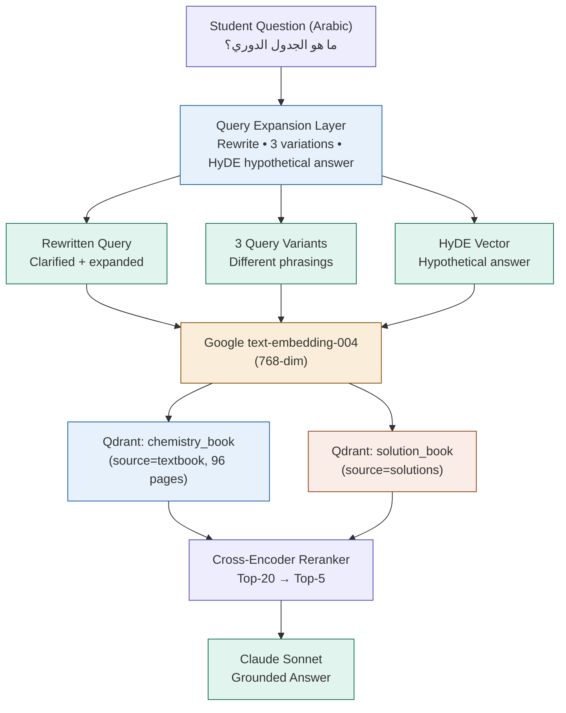

# EduMind Semantic RAG Architecture

Dual-source retrieval across chemistry book and solution book with query rewriting, HyDE, multi-query, and cross-encoder reranking.

---

## 1. Architecture Pipeline



### Why Each Layer Matters

*   **Query expansion**: A student writes *"ما الجدول الدوري؟"* — the raw embedding of that short question may not match the textbook's phrasing. Rewriting expands it before embedding.
*   **HyDE**: Instead of embedding the question, we ask the LLM to generate a hypothetical answer, then embed that. A good answer vector is much closer to the real answer chunks in embedding space.
*   **Multi-query**: 3 different phrasings of the same question — results from all 3 merged with Reciprocal Rank Fusion (RRF). Catches chunks that only match one phrasing.
*   **Dual source**: The chemistry book explains concepts. The solution book shows worked examples. A student asking *"how to balance this equation"* needs **BOTH**.
*   **Reranker**: A cross-encoder reads the question + each candidate chunk together (not just cosine similarity). Much more accurate than vector similarity alone.

---

## 2. Semantic Search

The 4 techniques that make RAG "understand" — not just "search":

### 1. Query rewriting — fix the question before searching
A Grade 9 student's Arabic question is often short, informal, or missing chemistry terms. Before embedding it, we pass it through the LLM with a prompt that expands, clarifies, and adds relevant chemistry vocabulary. *"ما هو الجدول؟"* becomes *"ما هو الجدول الدوري للعناصر؟ وكيف يتم ترتيب العناصر الكيميائية فيه؟"*

```python
QUERY_REWRITE_PROMPT = """
أنت مساعد تعليمي في مادة الكيمياء للصف التاسع.
أعد صياغة سؤال الطالب ليكون أكثر وضوحاً ودقةً علمية.
أضف المصطلحات الكيميائية المناسبة. لا تجب عن السؤال.
السؤال الأصلي: {question}
السؤال المُحسَّن:"""
```

### 2. HyDE — embed a hypothetical answer, not the question
The intuition: if you embed *"ما هو الجدول الدوري؟"* it lands near other questions. But if you ask the LLM to write what a textbook answer would look like, then embed **THAT** — it lands near the actual textbook chunks. This is Hypothetical Document Embeddings (HyDE). The vector of a good answer is much closer to real answer chunks than the vector of the question.

```python
HYDE_PROMPT = """
اكتب فقرة موجزة من كتاب الكيمياء للصف التاسع تجيب عن:
{question}
اكتب بأسلوب كتاب مدرسي. لا تقل "الجواب هو"."""
```

### 3. Multi-query + RRF — search with 3 phrasings, merge results
Generate 3 different formulations of the same question, run 3 separate Qdrant searches, then merge the ranked result lists using Reciprocal Rank Fusion. If a chunk appears in all 3 results it scores very high. If it only appears in 1 result it scores low. This makes retrieval robust — a chunk that only matches one specific phrasing of the question still gets found.

```python
# RRF score for chunk c:
score(c) = Σ 1 / (rank_in_query_i(c) + 60) for i = 1..3
# Top-20 chunks by RRF score → passed to reranker
```

### 4. Cross-encoder reranking — actually read question + chunk together
Vector similarity is fast but shallow — it compares embeddings independently. A cross-encoder reads the original question **AND** each candidate chunk together in one forward pass, scoring their relevance jointly. This is much more accurate but too slow to run on the whole corpus. So we use vector search to get top-20 candidates quickly, then rerank those 20 with the cross-encoder to get the final top-5. We use either a lightweight BGE reranker or a Gemini API call as the reranker.

```
Reranker options for Arabic:
1. BAAI/bge-reranker-v2-m3 (local, free, multilingual)
2. Gemini API: "Score 0-10: how relevant is this passage to the question?"
3. Cohere Rerank API (Arabic supported)
```

---

## 3. Dual Source

Two books, one search — how to architect it.

### Source Comparison

| Dimension | Chemistry Textbook | Solution Book |
| :--- | :--- | :--- |
| **Content** | Concepts, definitions, theory, diagrams, examples | Worked examples, step-by-step solutions, answer keys |
| **Use when** | Student asks *"what is X"* or *"explain Y"* | Student asks *"how to solve X"* or *"balance this equation"* |
| **Metadata** | `source="textbook"`, `chapter_id`, `page_num` | `source="solutions"`, `exercise_num`, `chapter_id` |
| **Pages** | 96 pages classified (Stage 1 done) | To be classified (Stage 1 needs to run) |
| **Collection** | `syria_grade_9_chemistry` | `syria_grade_9_chemistry` (same, filtered by source) |

### Single Collection vs Two Collections — Use ONE Collection
Store both books in the same Qdrant collection (`syria_grade_9_chemistry`) with a `source` metadata field (`"textbook"` or `"solutions"`). This lets you:
*   **Cross-source search**: Search both books in **ONE** query — reranker sees all 20 candidates from both sources and picks the 5 best regardless of source.
*   **Filter when needed**: Add `must=[FieldCondition(key="source", match="solutions")]` when you know the student needs a worked solution.
*   **Source attribution**: Every chunk has its source in metadata — the LLM always knows which book each passage came from and can cite it.

### Smart Source Routing — When to Search Which
*   **Theory question**: *"ما هو الجدول الدوري؟"* &rarr; search textbook only (`source=textbook`)
*   **Solve question**: *"احسب الكتلة المولية لـ H₂O"* &rarr; search solutions first, textbook as fallback
*   **Mixed question**: *"فسر ثم احل معادلة..."* &rarr; search **BOTH**, reranker decides the mix
*   **Default**: Search both, let the reranker pick — safe for all question types

*Route is decided by a lightweight classifier (keyword detection + LLM call with cache). "احسب", "حل", "اوجد" &rarr; solutions. "عرّف", "فسر", "ما هو" &rarr; textbook.*

### What the LLM Prompt Looks Like with Dual Sources

```text
أنت مدرّس كيمياء للصف التاسع. أجب على سؤال الطالب باستخدام
المقاطع التالية فقط. أشر إلى المصدر في إجابتك.

[من الكتاب المدرسي — صفحة 45]:
الجدول الدوري هو ترتيب للعناصر الكيميائية...

[من كتاب الحلول — تمرين 3.2]:
الحل: أولاً نوازن المعادلة، ثم...

سؤال الطالب: {question}
إجابتك (بالعربية):
```

---

## 4. Implementation

### Core Service: `app/services/semantic_rag.py`

```python
"""
app/services/semantic_rag.py
Full semantic RAG pipeline with query expansion, HyDE,
multi-query retrieval, and cross-encoder reranking.
Searches both chemistry_book and solution_book sources.
"""
from __future__ import annotations
import asyncio, hashlib, json
from dataclasses import dataclass
from typing import Literal

import google.generativeai as genai
from qdrant_client import AsyncQdrantClient
from qdrant_client.models import Filter, FieldCondition, MatchValue, ScoredPoint

from app.core.config import settings
from app.core.redis import redis_client

COLLECTION    = "syria_grade_9_chemistry"
TOP_VECTOR_K  = 20   # retrieve from Qdrant before reranking
TOP_FINAL_K   = 5    # after reranking — fed to LLM
EMBED_MODEL   = "models/text-embedding-004"
RERANK_MODEL  = "gemini-2.0-flash"


# ── data classes ─────────────────────────────────────────────────
@dataclass
class RetrievedChunk:
    content:    str
    source:     Literal["textbook", "solutions"]
    page:       int
    chapter_id: int | None
    score:      float


@dataclass
class RAGContext:
    chunks:          list[RetrievedChunk]
    rewritten_query: str
    sources_used:    list[str]
    retrieval_method: str


# ── embedding ─────────────────────────────────────────────────────
async def embed(text: str, task: str = "retrieval_query") -> list[float]:
    result = genai.embed_content(
        model=EMBED_MODEL, content=text, task_type=task
    )
    return result["embedding"]


# ── Stage 1: query rewriting ─────────────────────────────────────
REWRITE_PROMPT = """
أنت مساعد تعليمي في مادة الكيمياء للصف التاسع.
أعد صياغة سؤال الطالب ليكون أكثر وضوحاً ودقةً علمية.
أضف المصطلحات الكيميائية المناسبة. لا تجب عن السؤال.
أخرج السؤال المُحسَّن فقط بدون أي شرح.
السؤال: {q}
"""

async def rewrite_query(question: str) -> str:
    model = genai.GenerativeModel(RERANK_MODEL)
    r = await model.generate_content_async(
        REWRITE_PROMPT.format(q=question),
        generation_config={"temperature": 0.1, "max_output_tokens": 200}
    )
    return r.text.strip()


# ── Stage 2: HyDE ─────────────────────────────────────────────────
HYDE_PROMPT = """
اكتب فقرة قصيرة كما لو كانت من كتاب الكيمياء للصف التاسع
تجيب عن السؤال التالي. اكتب بأسلوب علمي مباشر.
السؤال: {q}
"""

async def generate_hyde_vector(question: str) -> list[float]:
    model = genai.GenerativeModel(RERANK_MODEL)
    r = await model.generate_content_async(
        HYDE_PROMPT.format(q=question),
        generation_config={"temperature": 0.3, "max_output_tokens": 300}
    )
    hyp_doc = r.text.strip()
    return await embed(hyp_doc, task="retrieval_document")


# ── Stage 3: multi-query variants ─────────────────────────────────
VARIANTS_PROMPT = """
اكتب 3 صياغات مختلفة للسؤال التالي في مادة الكيمياء.
أخرج كل سؤال في سطر منفصل فقط.
السؤال: {q}
"""

async def generate_query_variants(question: str) -> list[str]:
    model = genai.GenerativeModel(RERANK_MODEL)
    r = await model.generate_content_async(
        VARIANTS_PROMPT.format(q=question),
        generation_config={"temperature": 0.4, "max_output_tokens": 300}
    )
    lines = [l.strip() for l in r.text.strip().splitlines() if l.strip()]
    return lines[:3] or [question]


# ── Stage 4: Qdrant vector search ─────────────────────────────────
async def vector_search(
    client: AsyncQdrantClient,
    vector: list[float],
    source_filter: str | None = None,
    top_k: int = TOP_VECTOR_K,
) -> list[ScoredPoint]:
    filt = None
    if source_filter:
        filt = Filter(must=[FieldCondition(
            key="source", match=MatchValue(value=source_filter)
        )])
    return await client.search(
        collection_name=COLLECTION,
        query_vector=vector,
        query_filter=filt,
        limit=top_k,
        with_payload=True,
    )


# ── Stage 5: Reciprocal Rank Fusion ───────────────────────────────
def reciprocal_rank_fusion(
    ranked_lists: list[list[ScoredPoint]],
    k: int = 60
) -> list[ScoredPoint]:
    scores: dict[str, float] = {}
    points: dict[str, ScoredPoint] = {}
    for ranked in ranked_lists:
        for rank, point in enumerate(ranked):
            pid = str(point.id)
            scores[pid] = scores.get(pid, 0.0) + 1.0 / (rank + k)
            points[pid] = point
    sorted_ids = sorted(scores, key=lambda x: scores[x], reverse=True)
    return [points[pid] for pid in sorted_ids[:TOP_VECTOR_K]]


# ── Stage 6: cross-encoder reranking with Gemini ─────────────────
RERANK_PROMPT = """
من 0 إلى 10، كم هي صلة هذا المقطع بالسؤال؟
أخرج رقماً واحداً فقط.
السؤال: {q}
المقطع: {chunk}
الدرجة:"""

async def rerank_chunks(
    question: str,
    candidates: list[ScoredPoint],
) -> list[RetrievedChunk]:
    model = genai.GenerativeModel(RERANK_MODEL)

    async def score_one(point: ScoredPoint) -> tuple[ScoredPoint, float]:
        chunk_text = point.payload.get("content", "")[:600]
        try:
            r = await model.generate_content_async(
                RERANK_PROMPT.format(q=question, chunk=chunk_text),
                generation_config={"temperature": 0.0, "max_output_tokens": 5}
            )
            score = float(r.text.strip().split()[0])
        except:
            score = point.score * 10
        return point, score

    scored = await asyncio.gather(*[score_one(p) for p in candidates])
    scored.sort(key=lambda x: x[1], reverse=True)

    result = []
    for point, score in scored[:TOP_FINAL_K]:
        payload = point.payload
        result.append(RetrievedChunk(
            content=payload.get("content", ""),
            source=payload.get("source", "textbook"),
            page=payload.get("page", 0),
            chapter_id=payload.get("chapter_id"),
            score=score / 10,
        ))
    return result


# ── Main entry point ──────────────────────────────────────────────
async def get_rag_context(
    question: str,
    client: AsyncQdrantClient,
    source_hint: Literal["both", "textbook", "solutions"] = "both",
    use_hyde: bool = True,
    use_reranker: bool = True,
) -> RAGContext:
    # cache key
    cache_key = f"rag:{hashlib.md5(question.encode()).hexdigest()}:{source_hint}"
    cached = await redis_client.get(cache_key)
    if cached:
        return RAGContext(**json.loads(cached))

    # run expansion stages in parallel
    rewritten, variants, hyde_vec = await asyncio.gather(
        rewrite_query(question),
        generate_query_variants(question),
        generate_hyde_vector(question) if use_hyde else asyncio.sleep(0),
    )
    if not use_hyde:
        hyde_vec = None

    # embed all query variants + rewritten
    all_queries = [rewritten] + variants
    embed_tasks = [embed(q) for q in all_queries]
    if hyde_vec:
        embed_tasks = [asyncio.coroutine(lambda v=hyde_vec: v)()] + embed_tasks
    vectors = await asyncio.gather(*embed_tasks)

    # search Qdrant with each vector
    src = None if source_hint == "both" else source_hint
    search_tasks = [vector_search(client, v, src) for v in vectors]
    ranked_lists = await asyncio.gather(*search_tasks)

    # fuse results
    fused = reciprocal_rank_fusion(list(ranked_lists))

    # rerank
    chunks = await rerank_chunks(question, fused) if use_reranker \
        else [RetrievedChunk(
            content=p.payload.get("content",""),
            source=p.payload.get("source","textbook"),
            page=p.payload.get("page",0),
            chapter_id=p.payload.get("chapter_id"),
            score=p.score
        ) for p in fused[:TOP_FINAL_K]]

    ctx = RAGContext(
        chunks=chunks,
        rewritten_query=rewritten,
        sources_used=list({c.source for c in chunks}),
        retrieval_method="semantic+hyde+multiquery+reranker",
    )
    await redis_client.setex(cache_key, 3600, json.dumps(ctx.__dict__))
    return ctx
```

### Ingestion Script for Solution Book: `backend/scratch/ingest_solution_book.py`

```python
"""
backend/scratch/ingest_solution_book.py
Runs the same extraction pipeline on the solution book PDF.
Adds source="solutions" to every chunk payload.
"""
import asyncio
from pathlib import Path
from backend.scratch.extract_pages import run as extract_pages
from backend.scratch.build_chunks import build_chunks
from backend.scratch.seed_chunks import seed_to_qdrant

SOLUTION_PDF = Path("data/textbooks/syria_grade_9/solution_book.pdf")
OUTPUT_DIR   = Path("data/textbooks/syria_grade_9/solutions/")

async def main():
    print("Stage 1: classify + extract solution book pages...")
    # reuse same extract_pages.py logic, different output dir + PDF
    extract_pages(
        pdf_path=SOLUTION_PDF,
        output_dir=OUTPUT_DIR,
        source_tag="solutions",  # added to every chunk payload
    )

    print("Stage 2: build chunks from solution pages...")
    chunks = build_chunks(
        pages_dir=OUTPUT_DIR / "pages",
        chunk_size=500,   # smaller chunks for worked solutions
        chunk_overlap=60,
        source_tag="solutions",
        output_file=OUTPUT_DIR / "chunks.json",
    )
    print(f"  Built {len(chunks)} solution chunks")

    print("Stage 3: embed + upsert to Qdrant...")
    # same collection, source="solutions" in payload
    await seed_to_qdrant(
        chunks=chunks,
        collection="syria_grade_9_chemistry",
        source_tag="solutions",
    )
    print("Done — solution book is now searchable alongside textbook.")

if __name__ == "__main__":
    asyncio.run(main())
```

---

## 5. Codex Prompt

Complete prompt for Codex / Claude Sonnet 4.5:

```text
You are a senior AI/ML engineer and Python expert. I am building EduMind — an AI Chemistry Tutor for Grade 9 Arabic-speaking students. The backend uses FastAPI (async), PostgreSQL + pgvector, Redis, Qdrant, and Celery.

I need you to implement a SEMANTIC RAG system with dual-source retrieval. Read every file I attach before writing any code.

---

## CONTEXT: What already exists

- `backend/scratch/extract_pages.py` — extracts text from PDF pages (pdfplumber + Gemini OCR)
- `backend/scratch/build_chunks.py` — splits extracted text into chunks
- `backend/scratch/seed_chunks.py` — embeds chunks and upserts to Qdrant
- `data/textbooks/syria_grade_9/page_classification.json` — 96 pages classified
- `data/textbooks/syria_grade_9/pages/page_NNN.json` — extracted page content (Stage 2 output)
- Current Qdrant collection: `syria_grade_9_chemistry` (chemistry textbook chunks)
- Embedding model: Google `text-embedding-004` (768-dim)
- LLM: Gemini 2.0 Flash (via `google-generativeai` SDK)

## TASK 1 — Upgrade existing seed_chunks.py for dual-source support

Modify `seed_chunks.py` so every chunk payload in Qdrant includes these fields:
```json
{
  "content": "...",
  "source": "textbook",          ← "textbook" or "solutions"
  "page": 12,
  "chapter_id": 3,
  "section": "الروابط الكيميائية",
  "content_types": ["arabic_text", "equation"],
  "char_count": 487
}
```

Add a `--source` CLI argument: `python3 seed_chunks.py --source textbook` or `--source solutions`.

## TASK 2 — Ingest the solution book

Create `backend/scratch/ingest_solution_book.py` that:
1. Takes `--pdf` path to the solutions PDF as an argument
2. Runs `classify_pages.py` logic on the solutions PDF (save to `data/textbooks/syria_grade_9/solutions/`)
3. Runs `extract_pages.py` logic using the same OCRArena/Gemini pipeline
4. Runs `build_chunks.py` with `chunk_size=500, chunk_overlap=60` (solutions are denser)
5. Calls `seed_chunks.py` with `--source solutions`
6. Reports: total pages, chunks created, embedding time, upserted count

## TASK 3 — Create app/services/semantic_rag.py

Build a complete semantic RAG service with these 6 stages in a pipeline:

### Stage 1: Query rewriting
Use Gemini 2.0 Flash to rewrite the student's Arabic question. Add chemistry vocabulary. Remove ambiguity.

Prompt (use exactly this):
```
أنت مساعد تعليمي في مادة الكيمياء للصف التاسع.
أعد صياغة سؤال الطالب ليكون أكثر وضوحاً ودقةً علمية.
أضف المصطلحات الكيميائية المناسبة. لا تجب عن السؤال.
أخرج السؤال المُحسَّن فقط بدون أي شرح.
السؤال: {question}
```

### Stage 2: HyDE (Hypothetical Document Embeddings)
Generate a hypothetical textbook answer → embed it → use that vector for searching.

Prompt (use exactly this):
```
اكتب فقرة قصيرة كما لو كانت من كتاب الكيمياء للصف التاسع تجيب عن السؤال التالي.
اكتب بأسلوب كتاب مدرسي علمي. لا تقل "الجواب هو".
السؤال: {question}
```

### Stage 3: Multi-query generation
Generate 3 different phrasings of the question. Embed each one separately.

### Stage 4: Qdrant search (dual source)
- Search the Qdrant collection `syria_grade_9_chemistry` with EACH vector
- Support `source_hint` parameter: "both" | "textbook" | "solutions"
  - "textbook": add `must=[FieldCondition(key="source", match=MatchValue(value="textbook"))]`
  - "solutions": filter to solutions only
  - "both": no filter — search everything
- Retrieve top-20 candidates per vector search

### Stage 5: Reciprocal Rank Fusion
Merge all result lists (from multi-query + HyDE + rewritten query) using RRF formula:
`score(chunk) = Σ 1 / (rank_in_list_i + 60)` for each list where the chunk appears.
Return top-20 by RRF score.

### Stage 6: Cross-encoder reranking
Re-score the top-20 candidates by asking Gemini to score each one 0-10 for relevance to the original question. Use asyncio.gather to run all reranking calls in parallel. Return top-5.

Reranking prompt (use exactly this):
```
من 0 إلى 10، كم هي صلة هذا المقطع بسؤال الطالب؟
أخرج رقماً واحداً فقط بدون أي شرح.
السؤال: {question}
المقطع: {chunk}
الدرجة:
```

### Main function signature
```python
async def get_rag_context(
    question: str,
    qdrant_client: AsyncQdrantClient,
    source_hint: Literal["both", "textbook", "solutions"] = "both",
    use_hyde: bool = True,
    use_reranker: bool = True,
    cache_ttl: int = 3600,
) -> RAGContext:
```

Cache result in Redis with key = `rag:{md5(question)}:{source_hint}`. TTL = 3600 seconds.

Return a `RAGContext` dataclass:
```python
@dataclass
class RAGContext:
    chunks: list[RetrievedChunk]   # top-5 after reranking
    rewritten_query: str
    sources_used: list[str]        # ["textbook", "solutions"]
    retrieval_method: str          # "semantic+hyde+multiquery+reranker"
```

Each `RetrievedChunk`:
```python
@dataclass
class RetrievedChunk:
    content: str
    source: Literal["textbook", "solutions"]
    page: int
    chapter_id: int | None
    score: float   # 0.0 - 1.0 after reranking
```

## TASK 4 — Source routing classifier

Create `app/services/source_router.py` with:
```python
def classify_source_intent(question: str) -> Literal["both", "textbook", "solutions"]:
```

Rules:
- If question contains: احسب، حل، أوجد، طبّق، وازن → return "solutions"
- If question contains: عرّف، ما هو، اشرح، فسّر، لماذا → return "textbook"
- Otherwise → return "both"

Cache the result per question.

## TASK 5 — Update the chat endpoint to use semantic RAG

In `app/api/chat.py`, replace any existing call to `rag_service.get_relevant_context()` with:
```python
from app.services.source_router import classify_source_intent
from app.services.semantic_rag import get_rag_context

source_hint = classify_source_intent(user_message)
rag_ctx = await get_rag_context(
    question=user_message,
    qdrant_client=qdrant_client,
    source_hint=source_hint,
)
```

Build the LLM system prompt using the retrieved chunks, citing sources:
```python
def build_context_prompt(rag_ctx: RAGContext) -> str:
    parts = []
    for chunk in rag_ctx.chunks:
        label = "من الكتاب المدرسي" if chunk.source == "textbook" else "من كتاب الحلول"
        parts.append(f"[{label} — صفحة {chunk.page}]:\n{chunk.content}")
    return "\n\n".join(parts)
```

## TASK 6 — Update test_rag.py for dual-source testing

Add these test queries to `backend/scratch/test_rag.py`:
```python
TEST_QUERIES = [
    ("ما هو الجدول الدوري؟",            "textbook"),   # concept → textbook
    ("احسب الكتلة المولية لـ H₂SO₄",    "solutions"),  # calculation → solutions
    ("فسر ثم احل معادلة الاحتراق",       "both"),       # mixed → both
    ("ما الفرق بين الرابطة الأيونية والتساهمية؟", "textbook"),
]
```

For each query, print:
- Rewritten query
- Source routing decision
- Number of chunks from each source
- Top 3 chunks with source label and score
- Total pipeline latency (ms)

---

## HARD RULES — do not violate

1. ALL Qdrant calls must be async (use `AsyncQdrantClient`)
2. ALL Gemini calls must use `generate_content_async` (never sync)
3. Run independent stages in parallel with `asyncio.gather`
4. Cache both query rewrites (TTL=600s) and RAG results (TTL=3600s) in Redis
5. The embedding dimension MUST stay at 768 — never change the vector size
6. Arabic text must never be transliterated — always keep original Arabic script
7. Every function must have a Google-style docstring
8. No hardcoded API keys — use `settings.GEMINI_API_KEY`, `settings.QDRANT_URL`
9. The `source` field in Qdrant payload is a string: "textbook" or "solutions" (never a boolean or int)
10. Run `ruff check . --fix` before finishing — zero warnings allowed

## Files to attach

- `backend/scratch/extract_pages.py`
- `backend/scratch/build_chunks.py`
- `backend/scratch/seed_chunks.py`
- `backend/scratch/test_rag.py`
- `app/core/config.py`
- `app/api/chat.py` (the existing chat endpoint)
- `docker-compose.yml` (for Qdrant service name/port)
- `requirements.txt`
```
