# 🗄️ EduMind — Entity-Relationship Diagram (ERD)

> Database schema for the AI Chemistry Tutor backend
> ORM: SQLAlchemy | DB: PostgreSQL + pgvector

---

## 📊 Full ERD Diagram

```mermaid
erDiagram
    %% ━━━━━━━━━━━━━━━━━━━━━━━━━━━━━━━━━━━━━━━━━━━
    %%  CORE ENTITIES
    %% ━━━━━━━━━━━━━━━━━━━━━━━━━━━━━━━━━━━━━━━━━━━

    USERS {
        int id PK
        string first_name "NOT NULL"
        string last_name "NOT NULL"
        string email "UNIQUE, NOT NULL"
        string phone "e.g. +963912345678"
        string hashed_password "NOT NULL"
        string grade "grade_9"
        string subject "chemistry"
        string teaching_style "real-life | scientific | step-by-step"
        string answer_format "text | text+image | text+voice"
        string language "ar | en"
        int xp "default 0"
        int level "1=Beginner, 2=Scholar, 3=Expert, 4=Master"
        int streak_days "consecutive active days"
        date last_active_date "for streak calculation"
        timestamp created_at
        timestamp updated_at
    }

    INTEREST_CATEGORIES {
        int id PK
        string key "UNIQUE, e.g. football"
        string name_ar "NOT NULL, e.g. كرة القدم"
        string name_en "nullable, e.g. Football"
        string icon "emoji, e.g. ⚽"
        int display_order "order in picker UI"
        timestamp created_at
    }

    USER_INTERESTS {
        int id PK
        int user_id FK
        int interest_id FK
        timestamp created_at
    }

    CHAPTERS {
        int id PK
        string title_ar "NOT NULL"
        string title_en "nullable, future"
        string description_ar
        int order "display order in curriculum"
        int difficulty "1-3"
        string icon "icon identifier"
        timestamp created_at
    }

    LESSONS {
        int id PK
        int chapter_id FK
        string title_ar "NOT NULL"
        string title_en "nullable, future"
        text content_ar "lesson body, markdown"
        int order "order within chapter"
        int difficulty "1-3"
        int duration_min "estimated minutes"
        timestamp created_at
    }

    %% ━━━━━━━━━━━━━━━━━━━━━━━━━━━━━━━━━━━━━━━━━━━
    %%  PROGRESS TRACKING
    %% ━━━━━━━━━━━━━━━━━━━━━━━━━━━━━━━━━━━━━━━━━━━

    LESSON_PROGRESS {
        int id PK
        int user_id FK
        int lesson_id FK
        string status "not_started | in_progress | completed"
        timestamp completed_at "nullable"
        timestamp created_at
    }

    USER_PROGRESS {
        int id PK
        int user_id FK
        int topic_id FK
        int flashcards_mastered "count"
        int quizzes_completed "count"
        float best_quiz_score "percentage 0-100"
        timestamp last_activity
    }

    %% ━━━━━━━━━━━━━━━━━━━━━━━━━━━━━━━━━━━━━━━━━━━
    %%  AI CHAT
    %% ━━━━━━━━━━━━━━━━━━━━━━━━━━━━━━━━━━━━━━━━━━━

    CHAT_SESSIONS {
        int id PK
        int user_id FK
        string title "auto-generated or user-set"
        string style "real-life | scientific | step-by-step"
        timestamp created_at
        timestamp updated_at
    }

    CHAT_MESSAGES {
        int id PK
        int session_id FK
        string role "user | assistant"
        text content "markdown supported"
        string format "text | image | voice | video"
        string feedback "understood | not_understood | null"
        timestamp created_at
    }

    %% ━━━━━━━━━━━━━━━━━━━━━━━━━━━━━━━━━━━━━━━━━━━
    %%  TOPICS & QUIZZES
    %% ━━━━━━━━━━━━━━━━━━━━━━━━━━━━━━━━━━━━━━━━━━━

    TOPICS {
        int id PK
        string title_ar "NOT NULL"
        string title_en "nullable"
        text description_ar
        string category "organic | inorganic | physical | analytical"
        int difficulty "1-3"
        string icon "icon identifier"
        int order "display order"
        timestamp created_at
    }

    QUESTIONS {
        int id PK
        int topic_id FK
        text question_ar "NOT NULL"
        json options "list of 4 Arabic options"
        int correct_answer "index 0-3"
        text explanation_ar "shown after answering"
        int difficulty "1-3"
        string source "seeded | ai_generated"
        timestamp created_at
    }

    QUIZ_ATTEMPTS {
        int id PK
        int user_id FK
        int topic_id FK
        int score "correct answers count"
        int total "total questions"
        json answers "question_id to selected_option map"
        json weak_topics "auto-detected weak areas"
        timestamp completed_at
    }

    %% ━━━━━━━━━━━━━━━━━━━━━━━━━━━━━━━━━━━━━━━━━━━
    %%  FLASHCARDS
    %% ━━━━━━━━━━━━━━━━━━━━━━━━━━━━━━━━━━━━━━━━━━━

    FLASHCARDS {
        int id PK
        int topic_id FK
        text front_ar "question or term"
        text back_ar "answer or definition"
        string created_by "system | ai"
        timestamp created_at
    }

    FLASHCARD_PROGRESS {
        int id PK
        int user_id FK
        int flashcard_id FK
        boolean mastered "default false"
        int review_count "times reviewed"
        timestamp last_reviewed
    }

    %% ━━━━━━━━━━━━━━━━━━━━━━━━━━━━━━━━━━━━━━━━━━━
    %%  STUDY PLAN & HOMEWORK
    %% ━━━━━━━━━━━━━━━━━━━━━━━━━━━━━━━━━━━━━━━━━━━

    STUDY_PLANS {
        int id PK
        int user_id FK
        date exam_date "target exam date"
        json plan_json "daily lesson assignments"
        string status "active | completed | paused"
        timestamp created_at
        timestamp updated_at
    }

    HOMEWORK {
        int id PK
        int user_id FK
        int topic_id FK "nullable, auto-detected"
        text problem_text "submitted problem, Arabic"
        text solution "AI step-by-step solution, markdown"
        timestamp created_at
    }

    ACHIEVEMENTS {
        int id PK
        int user_id FK
        string name "e.g. first_lesson, streak_7"
        string icon "badge icon identifier"
        string condition "unlock rule description"
        timestamp earned_at
    }

    %% ━━━━━━━━━━━━━━━━━━━━━━━━━━━━━━━━━━━━━━━━━━━
    %%  RAG / VECTOR SEARCH
    %% ━━━━━━━━━━━━━━━━━━━━━━━━━━━━━━━━━━━━━━━━━━━

    TEXTBOOK_CHUNKS {
        int id PK
        int chapter_id FK "nullable"
        text content "raw text chunk"
        string source "textbook page or section ref"
        vector embedding "pgvector, 768-dim"
        timestamp created_at
    }

    %% ━━━━━━━━━━━━━━━━━━━━━━━━━━━━━━━━━━━━━━━━━━━
    %%  RELATIONSHIPS
    %% ━━━━━━━━━━━━━━━━━━━━━━━━━━━━━━━━━━━━━━━━━━━

    USERS ||--o{ USER_INTERESTS : "picks"
    USERS ||--o{ CHAT_SESSIONS : "creates"
    USERS ||--o{ LESSON_PROGRESS : "tracks"
    USERS ||--o{ QUIZ_ATTEMPTS : "attempts"
    USERS ||--o{ FLASHCARD_PROGRESS : "reviews"
    USERS ||--o{ USER_PROGRESS : "aggregates"
    USERS ||--o{ STUDY_PLANS : "plans"
    USERS ||--o{ HOMEWORK : "submits"
    USERS ||--o{ ACHIEVEMENTS : "earns"

    INTEREST_CATEGORIES ||--o{ USER_INTERESTS : "selected in"

    CHAPTERS ||--o{ LESSONS : "contains"
    CHAPTERS ||--o{ TEXTBOOK_CHUNKS : "sourced from"

    LESSONS ||--o{ LESSON_PROGRESS : "tracked by"

    CHAT_SESSIONS ||--o{ CHAT_MESSAGES : "contains"

    TOPICS ||--o{ QUESTIONS : "has"
    TOPICS ||--o{ FLASHCARDS : "has"
    TOPICS ||--o{ QUIZ_ATTEMPTS : "assessed by"
    TOPICS ||--o{ USER_PROGRESS : "tracked in"
    TOPICS ||--o{ HOMEWORK : "relates to"

    FLASHCARDS ||--o{ FLASHCARD_PROGRESS : "tracked by"
```

---

## 🔗 Relationship Summary

| Parent                          | Child                  | Type      | Description                             |
| ------------------------------- | ---------------------- | --------- | --------------------------------------- |
| **Users**                       | User Interests         | 1 → N     | A user picks many interests             |
| **Interest Categories**         | User Interests         | 1 → N     | An interest is picked by many users     |
| **Users ↔ Interest Categories** | _(via User Interests)_ | **M → N** | **Many-to-many through junction table** |
| **Users**                       | Chat Sessions          | 1 → N     | A user creates many chat sessions       |
| **Users**                       | Lesson Progress        | 1 → N     | A user has progress for each lesson     |
| **Users**                       | Quiz Attempts          | 1 → N     | A user takes many quizzes               |
| **Users**                       | Flashcard Progress     | 1 → N     | A user reviews many flashcards          |
| **Users**                       | User Progress          | 1 → N     | Aggregated progress per topic           |
| **Users**                       | Study Plans            | 1 → N     | A user may have multiple plans          |
| **Users**                       | Homework               | 1 → N     | A user submits many homework problems   |
| **Users**                       | Achievements           | 1 → N     | A user earns many badges                |
| **Chapters**                    | Lessons                | 1 → N     | A chapter contains many lessons         |
| **Chapters**                    | Textbook Chunks        | 1 → N     | RAG chunks sourced from chapters        |
| **Chat Sessions**               | Chat Messages          | 1 → N     | A session has many messages             |
| **Topics**                      | Questions              | 1 → N     | A topic has many quiz questions         |
| **Topics**                      | Flashcards             | 1 → N     | A topic has many flashcards             |
| **Topics**                      | Quiz Attempts          | 1 → N     | Quizzes are taken per topic             |
| **Topics**                      | User Progress          | 1 → N     | Progress is tracked per topic           |
| **Flashcards**                  | Flashcard Progress     | 1 → N     | Each card is tracked per user           |

---

## 🏗️ Entity Groups

### 🟢 Group 1 — Foundation (Month 1, Weeks 1-4)

> Build first — everything depends on these

| Entity            | Table                 | Priority                |
| ----------------- | --------------------- | ----------------------- |
| User              | `users`               | ✅ Done (needs update)  |
| Interest Category | `interest_categories` | Week 1 (seed data)      |
| User Interest     | `user_interests`      | Week 1 (junction table) |
| Chapter           | `chapters`            | Week 2                  |
| Lesson            | `lessons`             | Week 2                  |
| Lesson Progress   | `lesson_progress`     | Week 3                  |

### 🔵 Group 2 — AI Chat (Weeks 4-6)

> Core differentiator — RAG-powered tutoring

| Entity         | Table             | Priority |
| -------------- | ----------------- | -------- |
| Chat Session   | `chat_sessions`   | Week 4   |
| Chat Message   | `chat_messages`   | Week 4   |
| Textbook Chunk | `textbook_chunks` | Week 5   |

### 🟡 Group 3 — Assessment (Weeks 6-8)

> Quizzes, flashcards, study plans

| Entity             | Table                | Priority |
| ------------------ | -------------------- | -------- |
| Topic              | `topics`             | Week 6   |
| Question           | `questions`          | Week 7   |
| Quiz Attempt       | `quiz_attempts`      | Week 7   |
| Flashcard          | `flashcards`         | Week 8   |
| Flashcard Progress | `flashcard_progress` | Week 8   |
| Study Plan         | `study_plans`        | Week 7   |

### 🟣 Group 4 — Gamification & Extras (Weeks 9-12)

> Polish and retention features

| Entity        | Table           | Priority |
| ------------- | --------------- | -------- |
| User Progress | `user_progress` | Week 9   |
| Achievement   | `achievements`  | Week 10  |
| Homework      | `homework`      | Week 11  |

---

## 📝 Notes

- **pgvector**: The `textbook_chunks.embedding` column uses the `pgvector` extension for RAG similarity search
- **JSON columns**: `options`, `answers`, `weak_topics`, and `plan_json` are stored as JSON/JSONB for flexibility
- **Interests**: Modeled as a many-to-many relationship (`users` ↔ `interest_categories`) via the `user_interests` junction table — not stored as JSON
- **Soft deletes**: Not implemented in MVP — can be added later with `deleted_at` columns
- **Chapters vs Topics**: Chapters represent the curriculum structure (ordered units), while Topics represent subject categories used for quizzes and flashcards. A future migration could unify these
- **Interest seed data**: The `interest_categories` table ships with ~15 predefined categories (football, gaming, cooking, etc.) that the AI uses to personalize analogies
