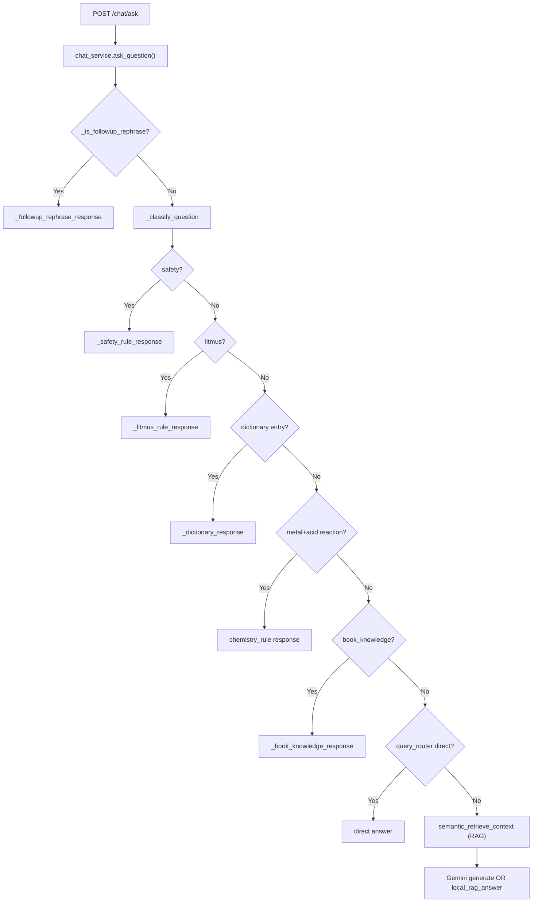

# Ask AI Pipeline Refactor — Implementation Plan

## Background & Problem Statement

The EduMind Ask AI system routes too many questions to RAG by default, causing:
1. **Semantic contamination**: "ما هو الماء؟" retrieves acid chunks containing "في الماء"
2. **Wrong query rewriting**: Safety questions get acid-definition rewrites
3. **Missing math solver**: Calculable problems get "not found" responses
4. **Gemini failures**: 429/503/504 errors with no deterministic fallback

---

## Current Architecture (Phase 0 Findings)

### Key Files Identified

| Component | File | Lines |
|-----------|------|-------|
| **Chat API endpoint** | [routes.py](file:///Users/sereenkh/Github-Projects/AI-Chemistry-Tutor/backend/app/api/chat/routes.py) | 141 |
| **Chat schemas** | [chat.py](file:///Users/sereenkh/Github-Projects/AI-Chemistry-Tutor/backend/app/schemas/chat.py) | 107 |
| **Chat service (orchestrator)** | [chat_service.py](file:///Users/sereenkh/Github-Projects/AI-Chemistry-Tutor/backend/app/services/chat_service.py) | **2362** |
| **AI/Gemini service** | [ai_service.py](file:///Users/sereenkh/Github-Projects/AI-Chemistry-Tutor/backend/app/services/ai_service.py) | 155 |
| **Gemini client** | [gemini_client.py](file:///Users/sereenkh/Github-Projects/AI-Chemistry-Tutor/backend/app/services/gemini_client.py) | ~150 |
| **Query router (deterministic)** | [query_router.py](file:///Users/sereenkh/Github-Projects/AI-Chemistry-Tutor/backend/app/services/query_router.py) | 372 |
| **Safety rules (services)** | [safety_rules.py](file:///Users/sereenkh/Github-Projects/AI-Chemistry-Tutor/backend/app/services/safety_rules.py) | 65 |
| **Chemistry rules (services)** | [chemistry_rules.py](file:///Users/sereenkh/Github-Projects/AI-Chemistry-Tutor/backend/app/services/chemistry_rules.py) | 287 |
| **Source router** | [source_router.py](file:///Users/sereenkh/Github-Projects/AI-Chemistry-Tutor/backend/app/services/source_router.py) | ~150 |
| **Semantic RAG retriever** | [semantic_rag.py](file:///Users/sereenkh/Github-Projects/AI-Chemistry-Tutor/backend/app/services/semantic_rag.py) | ~700 |
| **RAG utilities** | [rag.py](file:///Users/sereenkh/Github-Projects/AI-Chemistry-Tutor/backend/app/services/rag.py) | ~1000 |
| **Arabic normalizer (rag)** | [arabic_normalizer.py](file:///Users/sereenkh/Github-Projects/AI-Chemistry-Tutor/backend/app/rag/arabic_normalizer.py) | 88 |
| **Intent classifier (rag)** | [intent_classifier.py](file:///Users/sereenkh/Github-Projects/AI-Chemistry-Tutor/backend/app/rag/intent_classifier.py) | 107 |
| **Chemistry dictionary (rag)** | [chemistry_dictionary.py](file:///Users/sereenkh/Github-Projects/AI-Chemistry-Tutor/backend/app/rag/chemistry_dictionary.py) | 113 |
| **Chemistry entities JSON** | [chemistry_entities.json](file:///Users/sereenkh/Github-Projects/AI-Chemistry-Tutor/backend/app/rag/data/chemistry_entities.json) | 255 |
| **Book knowledge (rag)** | [book_knowledge.py](file:///Users/sereenkh/Github-Projects/AI-Chemistry-Tutor/backend/app/rag/book_knowledge.py) | 70 |
| **Chemistry rules (rag)** | [chemistry_rules.py](file:///Users/sereenkh/Github-Projects/AI-Chemistry-Tutor/backend/app/rag/chemistry_rules.py) | 87 |
| **Chunk validator (rag)** | [chunk_validator.py](file:///Users/sereenkh/Github-Projects/AI-Chemistry-Tutor/backend/app/rag/chunk_validator.py) | 84 |
| **Answer verifier (rag)** | [answer_verifier.py](file:///Users/sereenkh/Github-Projects/AI-Chemistry-Tutor/backend/app/rag/answer_verifier.py) | 42 |
| **Frontend AI API** | [aiApi.ts](file:///Users/sereenkh/Github-Projects/AI-Chemistry-Tutor/frontend-web/src/api/aiApi.ts) | 98 |
| **Frontend types** | [types.ts](file:///Users/sereenkh/Github-Projects/AI-Chemistry-Tutor/frontend-web/src/types.ts) | 124 |
| **Tests (QA)** | [test_rag_grade9_qa.py](file:///Users/sereenkh/Github-Projects/AI-Chemistry-Tutor/backend/tests/test_rag_grade9_qa.py) | 256 |
| **Tests (router)** | [test_query_router.py](file:///Users/sereenkh/Github-Projects/AI-Chemistry-Tutor/backend/tests/test_query_router.py) | ~100 |
| **Tests (chem rules)** | [test_chemistry_rules.py](file:///Users/sereenkh/Github-Projects/AI-Chemistry-Tutor/backend/tests/test_chemistry_rules.py) | ~50 |

### Current Request Flow



---

## Root Cause Analysis per Failure

### Failure 1: "ما هو الماء؟" → acid answer
**Status: ALREADY FIXED** ✅

The chemistry dictionary entry for "الماء" exists in [chemistry_entities.json](file:///Users/sereenkh/Github-Projects/AI-Chemistry-Tutor/backend/app/rag/data/chemistry_entities.json#L1-L15). The routing in `chat_service.ask_question()` at [line 1968](file:///Users/sereenkh/Github-Projects/AI-Chemistry-Tutor/backend/app/services/chat_service.py#L1968-L1982) checks dictionary first for `definition_lookup` intent. This should work when `answer_scope != "book_only"`.

**Remaining risk**: If the question reaches RAG (e.g., `answer_scope="book_only"`), the chunk validator should reject acid-only chunks for a water question — this is implemented in [chunk_validator.py L58](file:///Users/sereenkh/Github-Projects/AI-Chemistry-Tutor/backend/app/rag/chunk_validator.py#L58).

### Failure 2: "لماذا نضيف الحمض إلى الماء وليس العكس؟" → acid definition
**Status: ALREADY FIXED** ✅

The safety rule detection in [safety_rules.py](file:///Users/sereenkh/Github-Projects/AI-Chemistry-Tutor/backend/app/services/safety_rules.py) checks for acid+water triggers. The answer is hardcoded. The `_safety_rule_response` in chat_service returns it before reaching RAG.

**Remaining risk**: Query rewrite for safety_question intent — the rewrite in `services/safety_rules.py` sets `ACID_TO_WATER_REWRITE`, but the semantic_rag retriever may still use the wrong rewrite if the classification in `services/rag.py` misidentifies the intent. This is handled because the safety rule short-circuits before RAG.

### Failure 3: HCl concentration calculation → "not found"
**Status: PARTIALLY FIXED** ⚠️

The [query_router.py](file:///Users/sereenkh/Github-Projects/AI-Chemistry-Tutor/backend/app/services/query_router.py#L220-L260) has `_answer_hcl_concentration_exercise()` that handles HCl concentration problems. However, this route is checked LATE in `ask_question()` — at [line 2044](file:///Users/sereenkh/Github-Projects/AI-Chemistry-Tutor/backend/app/services/chat_service.py#L2044) — AFTER dictionary, litmus, metal reactions, and book knowledge checks.

**Gap**: The `_classify_question` function at [line 281](file:///Users/sereenkh/Github-Projects/AI-Chemistry-Tutor/backend/app/services/chat_service.py#L281-L312) correctly detects `exercise_solving` and sets `route = "math_solver"`, but the routing in `ask_question()` doesn't use this route classification to skip to the math solver early. Instead, the math solver (query_router) is checked only after several other routes fail. If those other routes accidentally match, the math question never reaches the solver.

### Failure 4: Gemini 429/503/504 → hang / bad fallback
**Status: PARTIALLY FIXED** ⚠️

The [ai_service.py](file:///Users/sereenkh/Github-Projects/AI-Chemistry-Tutor/backend/app/services/ai_service.py) has:
- Quota detection (429/RESOURCE_EXHAUSTED) → `AIQuotaExceededError`
- Transient error detection (503/504) → `AIServiceError`  
- Cooldown mechanism (`_GEMINI_GENERATION_DISABLED_UNTIL`)

The [chat_service.py _answer_with_rag_fallback()](file:///Users/sereenkh/Github-Projects/AI-Chemistry-Tutor/backend/app/services/chat_service.py#L1639-L1706) catches both and falls back to `_local_rag_answer()`.

**Gap**: When Gemini is down, `_local_rag_answer()` can still produce a poor answer for deterministic questions. The system should recognize that "ما هو الماء؟" doesn't need Gemini at all and use the dictionary/rules route directly, regardless of Gemini status. This is already mostly handled by the deterministic routes being checked before RAG, but the fallback within RAG could still produce confusing answers.

---

## Gap Analysis: What's Built vs What's Missing

### Already Implemented ✅
- Arabic normalization (`app/rag/arabic_normalizer.py`)
- Intent classification (in both `app/rag/intent_classifier.py` and `chat_service.py`)
- Chemistry dictionary with entities JSON (`app/rag/data/chemistry_entities.json` + `app/rag/chemistry_dictionary.py`)
- Safety rules (`app/services/safety_rules.py`)
- Litmus rules (in `chat_service.py` and `app/rag/chemistry_rules.py`)
- Metal + dilute acid reactions (`app/services/chemistry_rules.py`)
- Book knowledge entries (`app/rag/book_knowledge.py`)
- HCl concentration solver (`app/services/query_router.py`)
- Chunk validation (`app/rag/chunk_validator.py`)
- Answer verification (`app/rag/answer_verifier.py`)
- Followup rephrase handling (`chat_service.py`)
- Request/response schemas with structured blocks, sources, diagnostics
- Gemini circuit breaker with cooldown
- Frontend sends `answer_scope`, `preferred_answer_type`, `teaching_style`, `action`, etc.

### Missing / Needs Improvement ⚠️

| Phase | What's Missing | Impact |
|-------|---------------|--------|
| **P1 (Schema)** | `molar_mass_g_mol` field in chemistry_entities.json; `teaching_style` validation in schema | Low — schema is already mostly complete |
| **P5 (Dictionary)** | Missing entries: التركيز المولي, التركيز الغرامي definitions (present in query_router but not in entities JSON) | Medium |
| **P8 (Math Solver)** | General-purpose math solver for non-HCl concentration problems (e.g., NaOH, H₂SO₄). Current solver only handles HCl. Also, early routing to math solver before dictionary checks. | **High** |
| **P10 (Answer Router)** | The routing priority in `ask_question()` doesn't check `route` from `_classify_question()`. Math solver route is buried after dictionary/litmus/reaction/book_knowledge checks. | **High** |
| **P11 (Query Rewrite)** | Intent-specific rewrite is partially done (safety rewrite exists) but the semantic RAG may still use a generic rewrite. | Medium |
| **P12/P13 (Validation)** | Chunk validator and answer verifier exist but don't cover exercise_solving validation (e.g., checking computed values in answer) | Medium |
| **P17 (Diagnostics)** | Diagnostics already comprehensive in chat_service. Missing: `extracted_values` for math problems. | Low |
| **P18 (Tests)** | No standalone tests for the 10 test cases specified in the requirements. Existing tests use a QA harness with fixtures. | **High** |

---

## Proposed Changes

### Group 1: Fix Math Solver Routing Priority (Critical)

#### [MODIFY] [chat_service.py](file:///Users/sereenkh/Github-Projects/AI-Chemistry-Tutor/backend/app/services/chat_service.py)

In `ask_question()` (~line 1905-2044):
- Move the math solver check (`route_direct_answer` which includes `_answer_hcl_concentration_exercise`) to run **immediately after safety rules**, before dictionary/litmus checks, when `classification["route"] == "math_solver"` or `intent == "exercise_solving"`.
- This ensures "احسب التركيز الغرامي والمولي" never falls into dictionary/litmus/book_knowledge paths.

```diff
 safety_rule = _safety_rule_response(...)
 if safety_rule:
     return _finalize_answer(safety_rule, question)

+# Math solver takes priority for exercise_solving intent
+if intent == "exercise_solving" or classification.get("route") == "math_solver":
+    direct_answer = route_direct_answer(question)
+    if direct_answer:
+        # ... build response
+        return _finalize_answer(...)

 source_route = await route_source(question, source_types)
```

---

### Group 2: Generalize Math Solver

#### [MODIFY] [query_router.py](file:///Users/sereenkh/Github-Projects/AI-Chemistry-Tutor/backend/app/services/query_router.py)

Extend `_answer_hcl_concentration_exercise()` to handle any compound with known molar mass:
- Look up molar mass from chemistry_entities.json
- Add `molar_mass_g_mol` field to entities that need it
- Support NaOH (40 g/mol), H₂SO₄ (98 g/mol), etc.
- Rename to `_answer_concentration_exercise()` for generality

#### [MODIFY] [chemistry_entities.json](file:///Users/sereenkh/Github-Projects/AI-Chemistry-Tutor/backend/app/rag/data/chemistry_entities.json)

Add `molar_mass_g_mol` to compound entries:
- HCl: 36.5
- NaOH: 40
- H₂SO₄: 98
- NaCl: 58.5

Add missing definition entries:
- التركيز المولي (currently only in `query_router._answer_molar_concentration_definition`)
- التركيز الغرامي

---

### Group 3: Add Standalone Pipeline Tests

#### [NEW] [test_ask_ai_pipeline.py](file:///Users/sereenkh/Github-Projects/AI-Chemistry-Tutor/backend/tests/test_ask_ai_pipeline.py)

10 test cases matching the specification exactly:
1. "ما هو الماء؟" → `dictionary_first`, contains H₂O
2. "لماذا نضيف الحمض إلى الماء وليس العكس؟" → `safety_rule`, contains حرارة/تطاير/غليان
3. "ما هو التركيز المولي؟" → `dictionary_first`, contains C=n/V
4. HCl concentration problem → `math_solver`, contains 36.5 g/L, 1 mol/L
5. "ما لون ورقة عباد الشمس في المحاليل الحمضية؟" → `chemistry_rule`, contains الأحمر
6. "ما هي الحموض؟" → H⁺ in answer
7. "ما هي الأسس؟" → OH⁻ in answer
8. "هل يتفاعل النحاس مع حمض الكبريت الممدد؟" → `chemistry_rule`, لا يحدث تفاعل
9. Gemini 429 simulation → local router fallback
10. "اشرح بطريقة أبسط" → `followup_rephrase`, no RAG search

Each test calls `chat_service.ask_question()` directly (mocking DB and Gemini) and asserts on route, answer content, and absence of "لم أجد".

---

### Group 4: Minor Improvements

#### [MODIFY] [chemistry_entities.json](file:///Users/sereenkh/Github-Projects/AI-Chemistry-Tutor/backend/app/rag/data/chemistry_entities.json)
- Add `molar_concentration` and `gram_concentration` entries with definitions and formulas

#### [MODIFY] [answer_verifier.py](file:///Users/sereenkh/Github-Projects/AI-Chemistry-Tutor/backend/app/rag/answer_verifier.py)
- Add verification for math_solver answers (must contain computed values)
- Add safety answer verification (must contain حرارة/تطاير/غليان)

#### [MODIFY] [chat_service.py](file:///Users/sereenkh/Github-Projects/AI-Chemistry-Tutor/backend/app/services/chat_service.py)
- Add `extracted_values` to diagnostics for exercise_solving route
- Ensure `_classify_question` detects more exercise patterns (not just HCl)

---

## What I Will NOT Change

> [!IMPORTANT]
> The following are explicitly preserved to maintain backward compatibility:

- **API endpoint paths** (`/chat/ask`, `/chat/sessions`, etc.)
- **ChatAskRequest / ChatAnswerResponse** schema structure (only add optional fields)
- **Frontend API client** (already sends all required fields)
- **Existing RAG retrieval pipeline** (`semantic_rag.py`, `rag.py`)
- **Existing test fixtures** and QA harness
- **Gemini client** (`gemini_client.py`)
- **Chunk model / database schema**
- **Ingestion pipeline**

---

## Verification Plan

### Automated Tests
```bash
cd backend
python -m pytest tests/test_ask_ai_pipeline.py -v
python -m pytest tests/test_query_router.py -v
python -m pytest tests/test_chemistry_rules.py -v
```

### Manual Verification
- Run each of the 4 failure scenarios through the API
- Verify diagnostics output for each route
- Confirm Gemini fallback behavior by temporarily disabling API key

---

## Open Questions

> [!IMPORTANT]
> **Q1**: The `app/rag/` module has duplicated logic with `app/services/` (e.g., `chemistry_rules.py` exists in both, `intent_classifier.py` in `app/rag/` vs `_classify_question` in `chat_service.py`). Should I consolidate these into one place, or preserve both for now?
>
> **My recommendation**: Preserve both for now. The `app/rag/` modules are cleaner but aren't fully wired into the chat service. The chat service has its own inline versions that are actually used. Consolidation would be a larger refactor for a future iteration.

> [!NOTE]
> **Q2**: The `_answer_hcl_concentration_exercise()` in `query_router.py` hard-codes HCl molar mass as 36.5. Should I extend this to support arbitrary compounds from the dictionary, or keep it limited to compounds with known textbook exercises?
>
> **My recommendation**: Extend to support any compound with `molar_mass_g_mol` in `chemistry_entities.json`. This covers the Grade 9 curriculum without inventing new chemistry.

---

## Implementation Order

1. **Add molar_mass and concentration entries** to `chemistry_entities.json`
2. **Generalize math solver** in `query_router.py`
3. **Fix routing priority** in `chat_service.py` (move math solver before dictionary)
4. **Add verification rules** in `answer_verifier.py`
5. **Write all 10 test cases** in `test_ask_ai_pipeline.py`
6. **Run tests and verify**
